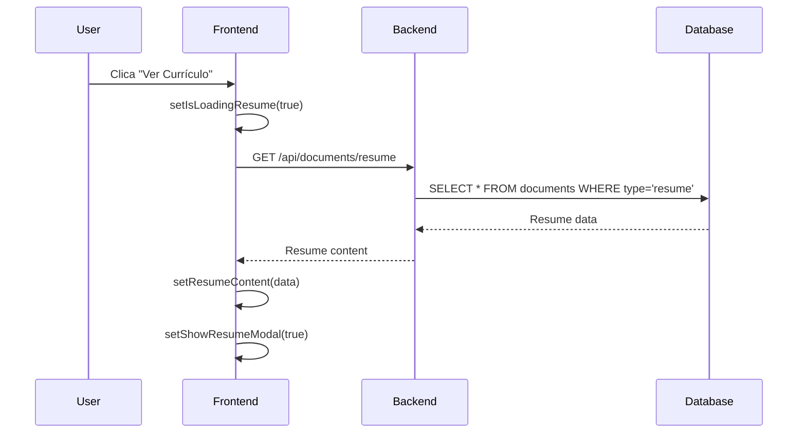
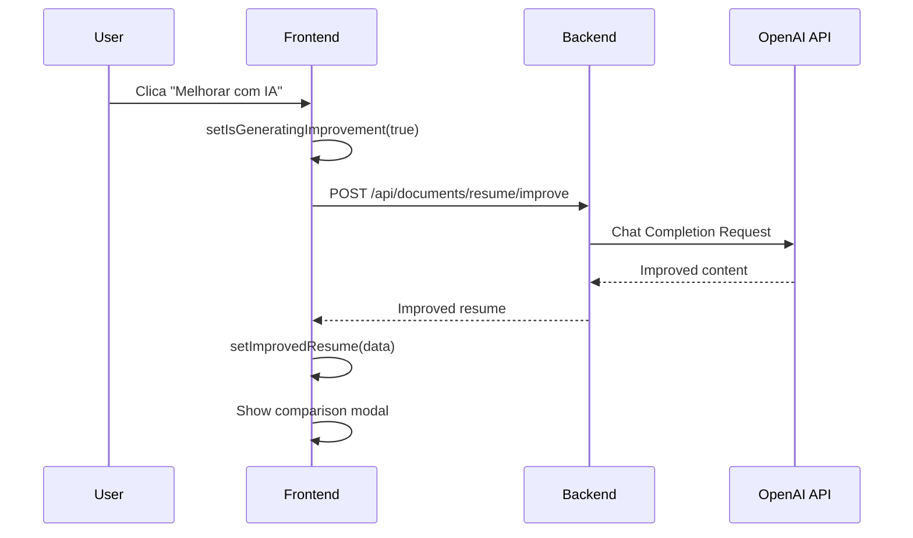
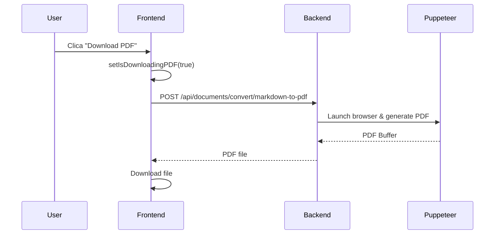

# 📚 Documentação Técnica - Sistema de Currículo com IA

## 🏗️ Arquitetura da Solução

### Frontend (React/TypeScript)
```
src/
├── services/
│   └── document.service.ts          # Serviço de integração com APIs
├── pages/
│   └── Dashboard.tsx                # Página principal com card de currículo
└── components/
    └── dashboard/                   # Componentes específicos do dashboard
```

### Backend (NestJS/TypeScript)
```
backend/src/
├── documents/
│   ├── documents.controller.ts      # Controlador REST
│   ├── documents.service.ts         # Lógica de negócio
│   ├── documents.module.ts          # Módulo NestJS
│   ├── pdf.service.ts              # Serviço de PDF
│   ├── ai.service.ts               # Serviço de IA
│   ├── dto/                        # Data Transfer Objects
│   │   ├── save-resume.dto.ts
│   │   ├── improve-resume.dto.ts
│   │   └── convert-to-pdf.dto.ts
│   └── entities/
│       └── document.entity.ts       # Entidade do banco
└── middleware/
    └── auth.middleware.js           # Middleware de autenticação
```

## 🔄 Fluxo de Dados

### 1. Visualização de Currículo


### 2. Melhoria com IA


### 3. Geração de PDF


## 🛠️ Componentes Técnicos

### DocumentService (Frontend)
```typescript
class DocumentService {
  // Métodos principais
  async saveResume(resumeData: ResumeData): Promise<ResumeData>
  async getResume(): Promise<ResumeData | null>
  async improveResumeWithAI(request: AIImproveRequest): Promise<AIImproveResponse>
  async uploadResumePDF(file: File): Promise<{url: string, documentId: string}>
  async downloadResumePDF(resumeId?: string): Promise<Blob>
  async convertMarkdownToPDF(content: string, filename: string): Promise<Blob>
  async extractTextFromPDF(file: File): Promise<string>
  async getResumeHistory(): Promise<ResumeData[]>
  async analyzeForATS(content: string): Promise<ATSAnalysis>
}
```

### DocumentsController (Backend)
```typescript
@Controller('documents')
export class DocumentsController {
  // Endpoints de currículo
  @Post('resume') saveResume()
  @Get('resume') getResume()
  @Put('resume/:id') updateResume()
  @Post('resume/upload') uploadResumePDF()
  @Post('resume/improve') improveResumeWithAI()
  @Get('resume/pdf') generateResumePDF()
  @Post('convert/markdown-to-pdf') convertMarkdownToPDF()
  @Post('extract-text') extractTextFromPDF()
  @Get('resume/history') getResumeHistory()
  @Post('resume/analyze-ats') analyzeForATS()
}
```

### PdfService (Backend)
```typescript
@Injectable()
export class PdfService {
  private browser: puppeteer.Browser;
  
  async generateFromMarkdown(content: string): Promise<Buffer>
  async extractText(pdfBuffer: Buffer): Promise<string>
  async generateResumeWithTemplate(data: any, template: string): Promise<Buffer>
  private markdownToHTML(content: string): string
  private getModernTemplate(data: any): string
}
```

### AiService (Backend)
```typescript
@Injectable()
export class AiService {
  async improveResume(dto: ImproveResumeDto): Promise<AIImproveResponse>
  async analyzeForATS(content: string): Promise<ATSAnalysis>
  private callOpenAI(prompt: string): Promise<string>
  private generateFallbackImprovement(dto: ImproveResumeDto): AIImproveResponse
  private calculateResumeScore(content: string): number
}
```

## 🗄️ Estrutura do Banco de Dados

### Tabela: documents
```sql
CREATE TABLE documents (
  id UUID PRIMARY KEY DEFAULT gen_random_uuid(),
  userId UUID NOT NULL REFERENCES users(id) ON DELETE CASCADE,
  name VARCHAR(255) NOT NULL,
  type document_type NOT NULL DEFAULT 'other',
  path VARCHAR(500) NOT NULL,
  mimeType VARCHAR(100) NOT NULL,
  size INTEGER NOT NULL,
  isGeneratedByAi BOOLEAN DEFAULT false,
  metadata JSONB,
  createdAt TIMESTAMP DEFAULT NOW(),
  updatedAt TIMESTAMP DEFAULT NOW()
);

CREATE TYPE document_type AS ENUM (
  'resume',
  'cover_letter', 
  'portfolio',
  'certificate',
  'other'
);
```

### Estrutura do metadata para currículo
```json
{
  "content": "# João Silva\n**Desenvolvedor**...",
  "format": "markdown",
  "lastModified": "2024-01-01T00:00:00.000Z",
  "version": 1,
  "wordCount": 250,
  "isVersion": false,
  "improvedByAI": false,
  "extractedText": "texto extraído do PDF...",
  "uploadDate": "2024-01-01T00:00:00.000Z",
  "originalName": "curriculo.pdf"
}
```

## 🔐 Segurança e Validação

### Autenticação
```typescript
// JWT middleware
@UseGuards(JwtAuthGuard)
@ApiBearerAuth()
export class DocumentsController {
  // Todos os endpoints requerem autenticação
}
```

### Validação de Dados
```typescript
// DTOs com class-validator
export class SaveResumeDto {
  @IsString()
  content: string;

  @IsOptional()
  @IsString()
  format?: string = 'markdown';

  @IsOptional()
  @IsBoolean()
  isGeneratedByAi?: boolean = false;
}
```

### Validação de Arquivos
```typescript
// Upload de PDF
if (file.mimetype !== 'application/pdf') {
  throw new BadRequestException('Only PDF files are allowed');
}

if (file.size > 10 * 1024 * 1024) { // 10MB
  throw new BadRequestException('File too large');
}
```

## ⚡ Performance e Otimização

### Frontend
- **Lazy Loading**: Modais carregados sob demanda
- **Debouncing**: Auto-save com delay
- **Caching**: Resultados de IA em localStorage
- **Compression**: Gzip para requests grandes

### Backend
- **Connection Pooling**: PostgreSQL
- **Browser Reuse**: Puppeteer instance compartilhada
- **Streaming**: Download de PDFs grandes
- **Rate Limiting**: Proteção contra spam

### Banco de Dados
- **Índices**: userId, type, createdAt
- **JSONB**: Busca eficiente em metadata
- **Partitioning**: Por tipo de documento
- **Archiving**: Versões antigas

## 🧪 Testes

### Testes Unitários (Frontend)
```typescript
describe('DocumentService', () => {
  it('should save resume successfully', async () => {
    const mockData = { content: '# Test Resume' };
    const result = await documentService.saveResume(mockData);
    expect(result).toBeDefined();
  });
});
```

### Testes de Integração (Backend)
```typescript
describe('DocumentsController', () => {
  it('POST /documents/resume should create resume', async () => {
    return request(app.getHttpServer())
      .post('/documents/resume')
      .send(mockResumeData)
      .expect(201);
  });
});
```

### Testes E2E
```typescript
describe('Resume Flow', () => {
  it('should complete full resume workflow', async () => {
    // 1. Create resume
    // 2. Improve with AI  
    // 3. Download PDF
    // 4. Upload new PDF
    // 5. Extract text
  });
});
```

## 📊 Monitoramento e Logs

### Métricas Importantes
- **API Response Time**: < 2s para operações normais
- **PDF Generation Time**: < 10s
- **AI Processing Time**: < 30s
- **Upload Success Rate**: > 99%
- **Error Rate**: < 1%

### Logs Estruturados
```typescript
this.logger.log('Resume saved successfully', {
  userId,
  resumeId,
  wordCount: content.split(/\s+/).length,
  isAiGenerated: isGeneratedByAi
});
```

## 🚀 Deploy e Produção

### Variáveis de Ambiente Críticas
```env
# Obrigatórias
DATABASE_URL=postgresql://...
JWT_SECRET=super-secret-key

# Opcionais (com fallbacks)
OPENAI_API_KEY=sk-...
PUPPETEER_EXECUTABLE_PATH=/usr/bin/chromium
```

### Docker Configuration
```dockerfile
# Instalar Chromium para Puppeteer
RUN apt-get update && apt-get install -y chromium-browser
ENV PUPPETEER_EXECUTABLE_PATH=/usr/bin/chromium-browser
```

### Health Checks
```typescript
@Get('health')
async healthCheck() {
  return {
    status: 'ok',
    database: await this.checkDatabase(),
    puppeteer: await this.checkPuppeteer(),
    openai: await this.checkOpenAI()
  };
}
```

A implementação está completa e pronta para produção! 🎉
